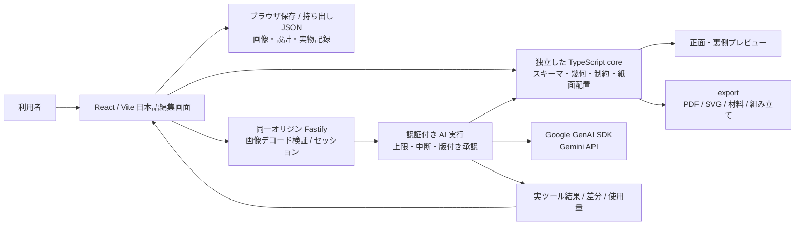

# アーキテクチャと実装判断

## 設計の基準

`DesignDocument` をプレビュー、検査、紙面配置、PDF/SVG、部品表、組み立て手順の唯一の基準とする。内部単位は mm。画像の選択は元画像 px、プレビューは SVG の mm viewBox、PDF は `72 / 25.4` pt/mm。設計ハッシュに時刻を含めない。保存した設計は読み込み時に正規化入力から再生成し、幾何・検査の改ざんを拒否する。

## 選択理由

- 最初の1機構は引っぱりタブ。水平・垂直は同じ機構を回転する。回転・揺動・歩行などを代わりに成立したことにしない。
- React + Vite / Fastify / Zod / Vitest / Playwright。npm workspaces とルートの単一 lockfile を利用。Node 24.20.0 を固定。既存実装は README のみだった。
- 幾何検査は AI から独立。モデルは提案だけを行い、固定条件の権限はセッション内の設計から得る。承認されるまでブラウザの設計を更新しない。
- 絵の切り出しは矩形。可動片は透明画素も含め白い紙に印刷する。元位置は通常白で、作者が単色または背景用画像の補正を比較して採用できる。共通の `getArtworkComposition` から画面・SVG・PDFへ同じ位置を反映する。輪郭や背景の自動復元ではない。
- `artworkRepair` がない旧設計はschema1と既存hashを保持する。明示補正の採用時はschema2・新revision/hashになり、旧候補・承認・PDFは失効する。画像本体はproject version2へ保存し、元絵と背景のhash・MIME・画素寸法を読込時/出力時に検証する。補正はAIのDesignPatchから分離する。
- 閲覧用ズーム・表示面・再生位置・工程の切替は設計を変更しない。PDF生成はWorkerで行い、応答時に現在の設計版と照合して古い出力を破棄する。
- サーバー上の永続保存と外部DBは導入しない。画像の内容をデコード・検査して返し、AIには画像を送らない初期構成。利用者の明示操作でブラウザに保存する。
- サーバーは一時メモリにセッション・実行状況を保持する。再起動で消え、複数インスタンス間で共有されない。公開の有料AI運用には別途認証・セッション経路・サービス全体の費用管理が必要。
- 日本語PDFは同梱の Zen Kaku Gothic New を fontkit で埋め込む。フォントだけの OFL を同梱し、本リポジトリへのライセンス付与は行わない。

## 幾何と実物の境界

コアが検査するのは、部品寸法、連結関係、直線移動の区間、ガイドのかかり、切り込み、用紙と枚数の条件。紙厚・摩擦・加工誤差・繰り返し耐久性は実測で保証していない。`unknown` は常に未検証として残す。配置は決定的な棚詰め方式であり、探索失敗は全配置の不可能性の証明ではない。

設計変更で hash/revision を更新し、以前の出力や承認は別の版として扱う。実物記録にも hash/revision と型紙名を付ける。実物記録の入力は、コアの検証状態を自動的に「検証済み」に変更しない。
